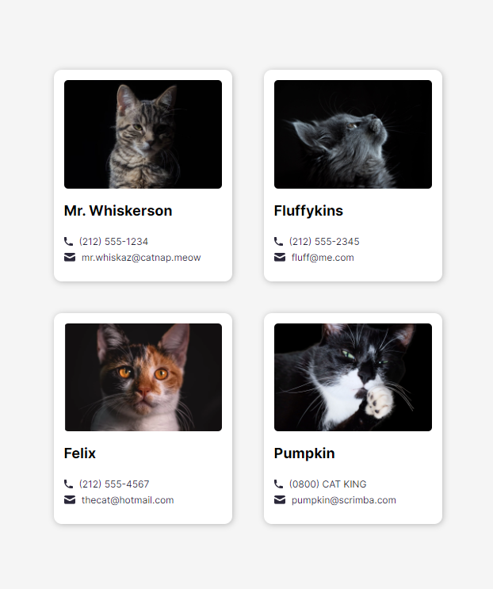
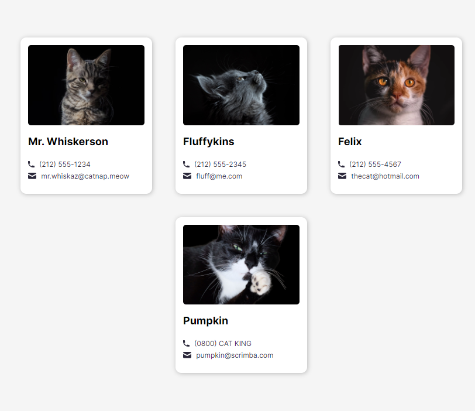
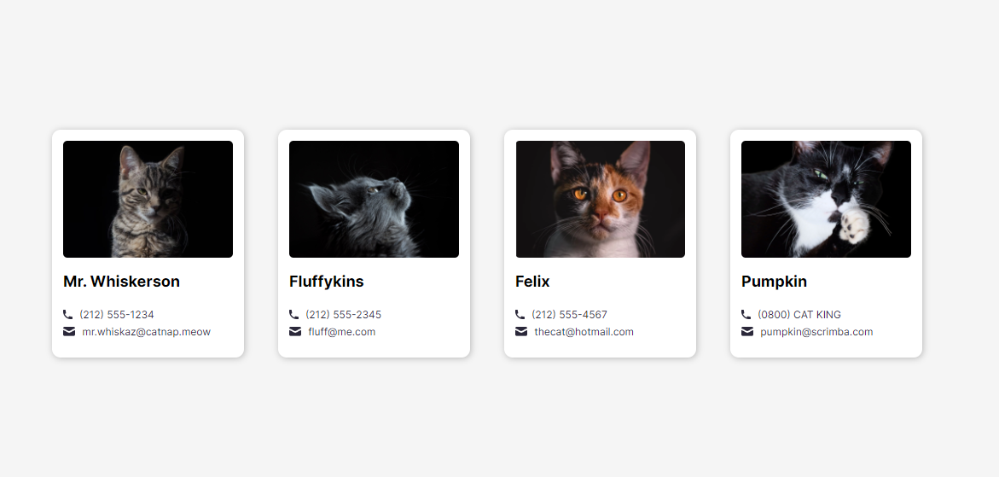

# My Cats Emails

Quick start:

```
# pnpm create vite

$ yarn
# npm install
# pnpm install

$ yarn build
# npm run build
# pnpm run build
```

## Development

Run Webpack in watch-mode to continually compile the JavaScript as you work:

```
$ yarn watch # npm run watch # pnpm run watch
```

# React + Vite

This template provides a minimal setup to get React working in Vite with HMR and some ESLint rules.

Currently, two official plugins are available:

- [@vitejs/plugin-react](https://github.com/vitejs/vite-plugin-react/blob/main/packages/plugin-react/README.md) uses [Babel](https://babeljs.io/) for Fast Refresh
- [@vitejs/plugin-react-swc](https://github.com/vitejs/vite-plugin-react-swc) uses [SWC](https://swc.rs/) for Fast Refresh

# About this Site

https://my-cats-emails.netlify.app/

This is my simple site which I made this with React & Vite. This shows the Cats images with email and phone numbers :)

### Mobile Version



### Tablet Version



### Desktop Version


